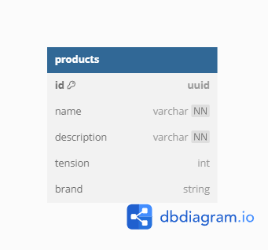

<h1 align ='center'> <strong>API Documentation<strong> </h1>

## **Content Table**

- [**Content Table**](#content-table)
- [**1. Overview**](#1-overview)
  - [**Author**](#author)
- [**2. Entity Relationship Diagram**](#2-entity-relationship-diagram)

 

---

## **1. Overview**

This api is for registration of brands and appliances, was built 
for my technical selection test of Grupo Plan Marketing.

These were the main technologies used in this project:

- [PHP](https://www.php.net/)
- [Laravel](https://laravel.com/)
- [Docker](https://hub.docker.com/_/docker-docs)
- [MySQL](https://www.mysql.com/)

**Base URL: https://cine-express-projeto-m4.herokuapp.com**

### **Author**

> - [Ricardo Martins](https://www.linkedin.com/in/ormartins02/) - Dev

 

## **2. Entity Relationship Diagram**

[ Back to the top ](#content-table)

 